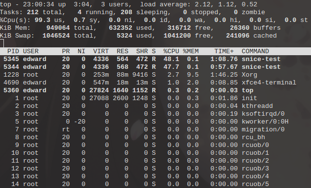
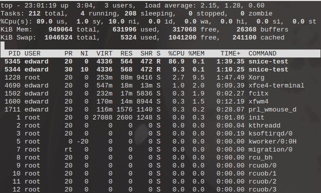
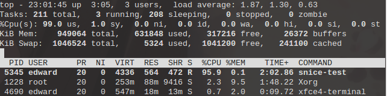
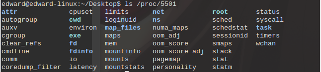
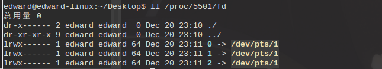
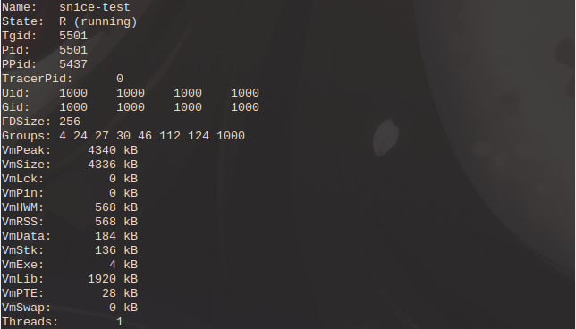
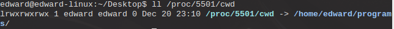
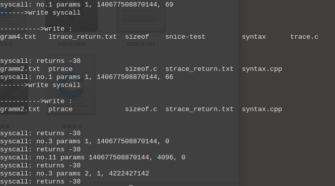

#
《操作系统》实验

##
3.1 进程行为观察

###
祝嘉栋 2012211196 @304班

##1. 实验目的
通过本实验了解并掌握Linux主要的进程管理命令

##2. 实验内容
1. 在Linux下，分别用`snice`、`skill`、`top`等命令和`/proc`中有关目录、文件观察系统中进程运行情况和CPU工作情况。
2. 在Linux下，用`ptrace()`、`gdb`跟踪一个进程运行情况，用`strace`工具跟踪`fork()`过程，用ltrace工具跟踪execl()过程。观察并分析跟踪信息。

##3. 实验过程和结果
###snice \ skill \ top 命令
####简介
#####`snice`命令

	snice [new priority] [options] process selection criteria

用于调整某个进程的nice值（静态优先级），nice值的范围是-20~+19，值越大优先级越小。默认用户进程的nice值为20，使用`snice`命令若不加参数默认为较初始值+4。

#####`skill`命令
	
	skill [signal to send] [options] process selection criteria

用于向某个进程发送信号，默认发送TERM信号即终止信号。

#####`top`命令
	
	top -hv | -abcHimMsS -d delay -n iterations -p pid [, pid ...]

显示系统的实时状态，包括系统的当前的基本状况、正在运行的任务，以及各个任务的信息，同时还提供了简单的交互方式来获取更详细的信息。

####实验
首先，编写了一个简单的程序

	// snice-test.c
	
	#include <stdio.h>
	#include <unistd.h>
	#include <time.h>
	
	void printTime() {
		time_t timep;
		struct tm *p_tm;
		timep = time(NULL);
		p_tm = localtime(&timep);
		printf("%d:%d:%d\n", p_tm->tm_hour, p_tm->tm_min, p_tm->tm_sec);
	}
	
	int main(int argc, char *argv[])
	{
		int i;
		while (1) {
			printf("%s ", argv[1]); // 显示当前进程名
			printTime(); // 显示系统当前时间
			for (i = 0; i < 50000000; i++);	 // 忙等待一段时间
		}
	
		return 0;
	}
	
同时运行两个该程序的实例

	$ ./snice-test A
	$ ./snice-test B
	

可以看到两个进程中显示的信息交替出现，可以推测出两个进程得到CPU时间大致相同。执行`top`命令，查看两个进程当前的优先级和CPU占用情况，

	$ top

观察到两个进程目前的优先级均为20，CPU占用率大致相等。下面使用`snice`命令降低A进程的优先级。

	$ snice +10 5344

观察到两个进程信息出现频率有了明显的差距，B进程显示信息的出现频率基本达到了A进程的10倍左右。再次执行`top`命令。

	$ top
	

此时观察到A进程的优先级发生了变化，至30，其CPU占用率仅为9.3%。而B进程则达到了86.9%。说明优先级的变化确实影响了CPU对进程的调度。

执行`skill`命令结束一个进程

	$ skill 5344

再次使用`top`命令发现A进程已经不再列表中，说明已经终止运行。

###`/proc` 目录

当一个用户进程运行时，在`/proc`目录下会建立以进程号命名的目录，以及在该目录下的一系列与该进程有关存有相应信息的文件和文件夹。

`fd` 目录中显示的是进程打开的文件链接。

`status` 文件中现实的是进程的基本信息。

`cwd` 是进程对应程序所在文件夹的软连接

其他文件和文件夹的内容参考 `man 5 proc`

###`ptrace()`函数

####简介
系统调用`ptrace()`可用于观察和控制其他进程的执行情况、查看和修改被跟踪进程运行时的寄存器和内存。主要用于实现断点Debug和系统调用跟踪。

	long ptrace(enum __ptrace_request request, pid_t pid, void *addr, void *data);
	
第一个参数为PTRACE请求类型的编号，第二个参数为被跟踪进程的PID，第三个和第四个分别传入地址和数据，根据请求类型的不同有不同的使用方法。

####实验

> Linux系统调用的参数通过寄存器来传递，对于x86-64架构，系统调用号存入`rax`寄存器中，参数依次存入`rdi`，`rsi`，`rdx`，`rcx`，`r8`，`r9`寄存器中。

> Linux 的系统调用编号存储在 `sys/syscall.h` 头文件中。

> write 系统调用共有三个参数，第一个为文件描述符，第二个为写入字符串的头指针，第三个为写入字符串的长度。

编写了下面一段程序

	// ptrace-test.c
	
	#include <stdio.h>
	#include <stdlib.h>
	#include <string.h>
	#include <sys/ptrace.h>
	#include <sys/types.h>
	#include <sys/wait.h>
	#include <unistd.h>
	#include <sys/syscall.h>
	#include <sys/user.h>
	
	#define WORD_SIZE (sizeof(long))
	
	union word {
		unsigned long long int val;
		char chars[WORD_SIZE];
	}; 
	typedef union word WORD; // WORD 类型用于获取从被跟踪进程中取出的1个字大小的内存数据
	
	void getData(unsigned long begin, unsigned long length, char * str)
	{
		unsigned long i, length, j;

		char * pos = str;
		/* 一次拷贝一个字的数据 */
		for (i = 0; i < length / WORD_SIZE; i++) {
				w.val = ptrace(PTRACE_PEEKDATA, child, begin + i * WORD_SIZE, NULL);
				memcpy(pos, w.chars, WORD_SIZE);
				pos += WORD_SIZE;
			}
			/* 拷贝数据结尾不足一个字的数据 */
			j = length % WORD_SIZE;
			if (j) {
				w.val = ptrace(PTRACE_PEEKDATA, child, begin + i * WORD_SIZE, NULL);
				memcpy(pos, w.chars, j);
			}
			str[length] = '\0';
		}
	}
	
	int main()
	{
		pid_t child; // 子进程编号
		struct user_regs_struct regs; 
		child = fork(); // 创建子进程
		int status;
		int insyscall = 0;
		unsigned long i, length, j;
		unsigned long begin;
		char * str = NULL, * pos = NULL;
		WORD w;
	
		if (child == 0) {
			ptrace(PTRACE_TRACEME, 0, NULL, NULL); // 接受跟踪请求
			execl("/bin/ls", "ls", NULL); // 执行 ls 命令
		}
		else {
			while(1) {
				// 等待子进程进行系统调用或结束
				wait(&status); 
				
				// 如果进程处于结束状态则跳出循环
				if(WIFEXITED(status)) { 
					break;
				}
				// 查询此时的寄存器的值
				ptrace(PTRACE_GETREGS, child, NULL, &regs); 
				if (insyscall == 0) { // 如果当前是进入系统调用
					insyscall = 1;
					// 打印寄存器的值
					printf("syscall: no.%llu params %llu, %llu, %llu\n", 
						regs.orig_rax, regs.rdi, regs.rsi, regs.rdx); 
					// 如果是 write 系统调用
					if (regs.orig_rax == SYS_write) {
						printf("------>write syscall\n");
						length = regs.rdx;
						begin = regs.rsi;
						str = (char *)malloc(sizeof(char) * (length + 1));
						/* 拷贝出被跟踪进程输出字符串的内存数据 */
						getData(begin, length, str);
						/* 将字符串打印出来 */
						printf("\n------>write : \n%s \n\n", str);
					}
				}
				else {
					// 输出系统调用的返回值
					printf("syscall: returns %lld\n", regs.rax); 
					insyscall = 0;
				}
				
				ptrace(PTRACE_SYSCALL, child, NULL, NULL);
			}
			
		}
	
		return 0;
	}
	
该程序创建了一个子进程，子进程执行`ls`命令，父进程使用`ptrace()`跟踪字进程执行。子进程每次进行系统调用，内核将控制权交给父进程，父进程调用ptrace()查看子进程当前寄存器的值，以获取当前系统调用的编号、参数和返回值，若是系统调用`write`，则使用`PTRACE_PEEKDATA`请求将子进程所在内存空间中要写入的字符串的内存数据拷贝至父进程的内存空间中，并输出字符串。

####实验结果

通过输出结果可以看出，打印出了子进程每次进行系统调用的系统调用号，参数列表和返回值，`PTRACE_GETREGS`请求被成功处理。看到父进程打印的结果与子进程一致，子进程的内存数据被成功拷贝到父进程中。

###`strace`和`ltrace`命令

####简介

#####`strace`命令
`strace`命令用于中断和记录进程所进行的系统调用过程，包括系统调用类型、参数及返回值。

#####`ltrace`命令
`ltrace`命令用于中断和记录进程的动态库调用过程，也可以中断和显示由该程序发起的系统调用（默认不显示）。

####实验及结果

编写了如下程序
	
	// trace.c
	
	#include <stdio.h>
	#include <stdlib.h>
	#include <string.h>
	#include <sys/ptrace.h>
	#include <sys/types.h>
	#include <sys/wait.h>
	#include <unistd.h>
	#include <sys/syscall.h>
	#include <sys/user.h>
	
	#define WORD_SIZE (sizeof(long))
	
	union word {
		unsigned long long int val;
		char chars[WORD_SIZE];
	};
	
	typedef union word WORD;
	
	int main()
	{
		pid_t child;
		struct user_regs_struct regs;
		child = fork();
	
		if (child == 0) {
			execl("/bin/ls", "ls", NULL);
		}
		else {
			printf("child pid : %u\n", child);
			wait(NULL);
			printf("child process returned.\n");
			
		}
	
		return 0;
	}

该程序创建了一个子进程，子进程执行`ls`命令，父进程打印子进程的PID，待子进程结束输出提示信息。

执行结果

	$ ./trace
	child pid : 3823
	gdb        gram4.txt          ptrace    snice.c            syntax
	gdb.c      gramm2.txt         ptrace.c  snice-test         syntax.cpp
	gdb.txt    grammar.txt        sizeof    strace_return.txt  trace
	gram3.txt  ltrace_return.txt  sizeof.c  strace.txt         trace.c
	child process returned.

使用`strace`命令跟踪程序

	$ strace ./trace
	
输出结果
	
		execve("./trace", ["./trace"], [/* 68 vars */]) = 0
		brk(0)                                  = 0x11ce000
		access("/etc/ld.so.nohwcap", F_OK)      = -1 ENOENT (No such file or directory)
		mmap(NULL, 8192, PROT_READ|PROT_WRITE, MAP_PRIVATE|MAP_ANONYMOUS, -1, 0) = 0x7fdb76961000
		access("/etc/ld.so.preload", R_OK)      = -1 ENOENT (No such file or directory)
		open("/etc/ld.so.cache", O_RDONLY|O_CLOEXEC) = 3
		fstat(3, {st_mode=S_IFREG|0644, st_size=118840, ...}) = 0
		mmap(NULL, 118840, PROT_READ, MAP_PRIVATE, 3, 0) = 0x7fdb76943000
		close(3)                                = 0
		access("/etc/ld.so.nohwcap", F_OK)      = -1 ENOENT (No such file or directory)
		open("/lib/x86_64-linux-gnu/libc.so.6", O_RDONLY|O_CLOEXEC) = 3
		read(3, "\177ELF\2\1\1\0\0\0\0\0\0\0\0\0\3\0>\0\1\0\0\0\360\36\2\0\0\0\0\0"..., 832) = 832
		fstat(3, {st_mode=S_IFREG|0755, st_size=1853400, ...}) = 0
		mmap(NULL, 3961912, PROT_READ|PROT_EXEC, MAP_PRIVATE|MAP_DENYWRITE, 3, 0) = 0x7fdb76379000
		mprotect(0x7fdb76536000, 2097152, PROT_NONE) = 0
		mmap(0x7fdb76736000, 24576, PROT_READ|PROT_WRITE, MAP_PRIVATE|MAP_FIXED|MAP_DENYWRITE, 3, 0x1bd000) = 0x7fdb76736000
		mmap(0x7fdb7673c000, 17464, PROT_READ|PROT_WRITE, MAP_PRIVATE|MAP_FIXED|MAP_ANONYMOUS, -1, 0) = 0x7fdb7673c000
		close(3)                                = 0
		mmap(NULL, 4096, PROT_READ|PROT_WRITE, MAP_PRIVATE|MAP_ANONYMOUS, -1, 0) = 0x7fdb76942000
		mmap(NULL, 8192, PROT_READ|PROT_WRITE, MAP_PRIVATE|MAP_ANONYMOUS, -1, 0) = 0x7fdb76940000
		arch_prctl(ARCH_SET_FS, 0x7fdb76940740) = 0
		mprotect(0x7fdb76736000, 16384, PROT_READ) = 0
		mprotect(0x600000, 4096, PROT_READ)     = 0
		mprotect(0x7fdb76963000, 4096, PROT_READ) = 0
		munmap(0x7fdb76943000, 118840)          = 0
	-->	clone(child_stack=0, flags=CLONE_CHILD_CLEARTID|CLONE_CHILD_SETTID|SIGCHLD, child_tidptr=0x7fdb76940a10) = 3823
		fstat(1, {st_mode=S_IFCHR|0620, st_rdev=makedev(136, 0), ...}) = 0
		mmap(NULL, 4096, PROT_READ|PROT_WRITE, MAP_PRIVATE|MAP_ANONYMOUS, -1, 0) = 0x7fdb76960000
		write(1, "child pid : 3823\n", 17)      = 17
		wait4(-1, NULL, 0, NULL)                = 3823
		--- SIGCHLD {si_signo=SIGCHLD, si_code=CLD_EXITED, si_pid=3823, si_status=0, si_utime=0, si_stime=0} ---
		write(1, "child process returned.\n", 24) = 24
		exit_group(0)                           = ?
		+++ exited with 0 +++

此时无法找到`fork`系统调用，在`man 2 fork`中找到如下解释

> Since version 2.3.3, rather than invoking the kernel's fork() system call, the glibc fork() wrapper that is provided as part of the NPTL threading implementation invokes clone(2) with flags that provide the same effect as the traditional system call.  (A call to fork() is equivalent to a call to clone(2) specifying flags as just SIGCHLD.) The glibc wrapper invokes any fork handlers that have been established using pthread_atfork(3).

说明其实调用glibc中的`fork()`函数其实就是在调用flags参数为`SIGCHLD`的`clone()`函数，即调用系统调用`clone`。可以看到输出结果中标记的一行为`clone`系统调用的记录，返回值为子进程PID。

使用`ltrace`命令跟踪程序中的`execl()`函数

	$ ltrace -f -e execl ./trace
	
输出结果

	child pid : 5214
	[pid 5214] execl(0x400767, 0x400764, 0, -1, 0 <unfinished ...>
	[pid 5214] --- Called exec() ---
	gdb	   gram4.txt	      ptrace	snice.c		   syntax
	gdb.c	   gramm2.txt	      ptrace.c	snice-test	   syntax.cpp
	gdb.txt    grammar.txt	      sizeof	strace_return.txt  trace
	gram3.txt  ltrace_return.txt  sizeof.c	strace.txt	   trace.c
	[pid 5214] +++ exited (status 0) +++
	[pid 5213] --- SIGCHLD (Child exited) ---
	child process returned.
	[pid 5213] +++ exited (status 0) +++

看到ltrace跟踪到了程序中的动态库中`execl()`函数调用。

####`gdb`的使用
编写了如下简单的计算斐波那契数的程序，使用`gdb`命令来跟踪和调试程序。

	#include <stdio.h>
	
	int func(int n)
	{
		if (n < 1) {
			return 0;
		}
		if (n == 1 || n == 2) {
			return 1;
		}
		return func(n - 1) + func(n - 2);
	}
	
	int main()
	{
		printf("%d\n", func(5));
	
		return 0;
	}
	
开始跟踪
	
	$ gdb ./gdb
	
	GNU gdb (GDB) 7.6.1-ubuntu
	Copyright (C) 2013 Free Software Foundation, Inc.
	License GPLv3+: GNU GPL version 3 or later <http://gnu.org/licenses/gpl.html>
	This is free software: you are free to change and redistribute it.
	There is NO WARRANTY, to the extent permitted by law.  Type "show copying"
	and "show warranty" for details.
	This GDB was configured as "x86_64-linux-gnu".
	For bug reporting instructions, please see:
	<http://www.gnu.org/software/gdb/bugs/>...
	Reading symbols from /home/edward/programs/gdb...done.
	(gdb) l 0 // 列出前10行代码
	1	#include <stdio.h>
	2	
	3	int func(int n)
	4	{
	5		if (n < 1) {
	6			return 0;
	7		}
	8		if (n == 1 || n == 2) {
	9			return 1;
	10		}
	(gdb) break 3 // 在第3行设置断点
	Breakpoint 1 at 0x400539: file gdb.c, line 3.
	(gdb) r // 开始运行程序
	Starting program: /home/edward/programs/./gdb 
	
	Breakpoint 1, func (n=5) at gdb.c:5 // 在断点处中断
	5		if (n < 1) {    
	(gdb) disassemble func // 输出反汇编程序
	Dump of assembler code for function func:
	   0x000000000040052d <+0>:	push   %rbp
	   0x000000000040052e <+1>:	mov    %rsp,%rbp
	   0x0000000000400531 <+4>:	push   %rbx
	   0x0000000000400532 <+5>:	sub    $0x18,%rsp
	   0x0000000000400536 <+9>:	mov    %edi,-0x14(%rbp)
	=> 0x0000000000400539 <+12>:	cmpl   $0x0,-0x14(%rbp)
	   0x000000000040053d <+16>:	jg     0x400546 <func+25>
	   0x000000000040053f <+18>:	mov    $0x0,%eax
	   0x0000000000400544 <+23>:	jmp    0x400577 <func+74>
	   0x0000000000400546 <+25>:	cmpl   $0x1,-0x14(%rbp)
	   0x000000000040054a <+29>:	je     0x400552 <func+37>
	   0x000000000040054c <+31>:	cmpl   $0x2,-0x14(%rbp)
	   0x0000000000400550 <+35>:	jne    0x400559 <func+44>
	   0x0000000000400552 <+37>:	mov    $0x1,%eax
	   0x0000000000400557 <+42>:	jmp    0x400577 <func+74>
	   0x0000000000400559 <+44>:	mov    -0x14(%rbp),%eax
	   0x000000000040055c <+47>:	sub    $0x1,%eax
	   0x000000000040055f <+50>:	mov    %eax,%edi
	   0x0000000000400561 <+52>:	callq  0x40052d <func>
	   0x0000000000400566 <+57>:	mov    %eax,%ebx
	   0x0000000000400568 <+59>:	mov    -0x14(%rbp),%eax
	   0x000000000040056b <+62>:	sub    $0x2,%eax
	---Type <return> to continue, or q <return> to quit---q
	Quit
	(gdb) print n // 打印局部变量n的值
	$1 = 5
	(gdb) n // 单步运行
	8		if (n == 1 || n == 2) {
	(gdb) n
	11		return func(n - 1) + func(n - 2);
	(gdb) n
	
	Breakpoint 1, func (n=4) at gdb.c:5
	5		if (n < 1) {
	(gdb) n
	8		if (n == 1 || n == 2) {
	(gdb) n
	11		return func(n - 1) + func(n - 2);
	(gdb) bt // 打印调用栈
	#0  func (n=4) at gdb.c:11
	#1  0x0000000000400566 in func (n=5) at gdb.c:11
	#2  0x000000000040058c in main () at gdb.c:16
	(gdb) n
	
	Breakpoint 1, func (n=3) at gdb.c:5
	5		if (n < 1) {
	(gdb) n
	8		if (n == 1 || n == 2) {
	(gdb) bt
	#0  func (n=3) at gdb.c:8
	#1  0x0000000000400566 in func (n=4) at gdb.c:11
	#2  0x0000000000400566 in func (n=5) at gdb.c:11
	#3  0x000000000040058c in main () at gdb.c:16
	(gdb) r
	The program being debugged has been started already.
	Start it from the beginning? (y or n) n
	Program not restarted.
	(gdb) info registers // 打印寄存器的值
	rax            0x3	3
	rbx            0x0	0
	rcx            0x40057e	4195710
	rdx            0x7fffffffdf48	140737488346952
	rsi            0x7fffffffdf38	140737488346936
	rdi            0x3	3
	rbp            0x7fffffffdde0	0x7fffffffdde0
	rsp            0x7fffffffddc0	0x7fffffffddc0
	r8             0x7ffff7dd4e80	140737351863936
	r9             0x7ffff7de9d40	140737351949632
	r10            0x7fffffffdcc0	140737488346304
	r11            0x7ffff7a33cf0	140737348058352
	r12            0x400440	4195392
	r13            0x7fffffffdf30	140737488346928
	r14            0x0	0
	r15            0x0	0
	rip            0x400546	0x400546 <func+25>
	eflags         0x206	[ PF IF ]
	cs             0x33	51
	ss             0x2b	43
	ds             0x0	0
	es             0x0	0
	fs             0x0	0
	---Type <return> to continue, or q <return> to quit---
	
	(gdb) clear // 清除所有断点
	已删除的断点 1 
	(gdb) c // 运行至程序结束
	Continuing.
	5
	[Inferior 1 (process 4001) exited with code 02]
	(gdb) quit
	
##参考文献
- Wikipedia
- Linux Manual
