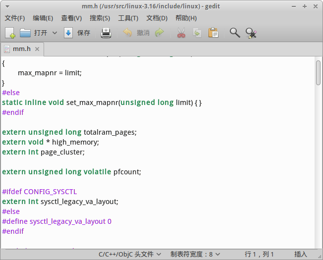
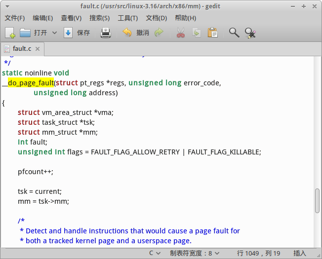
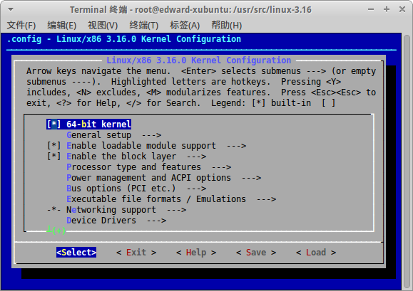
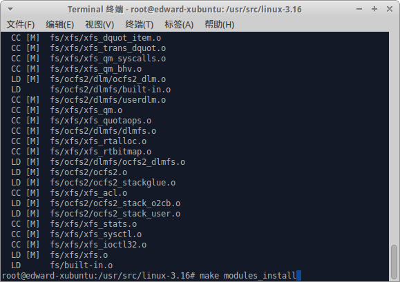
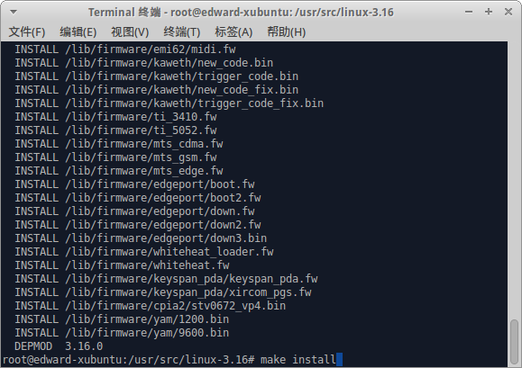
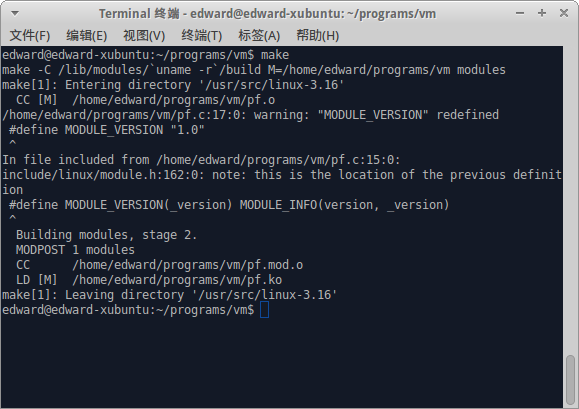
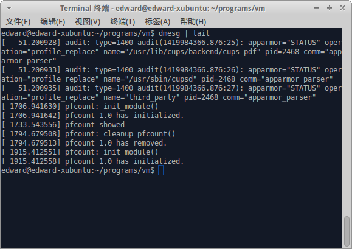
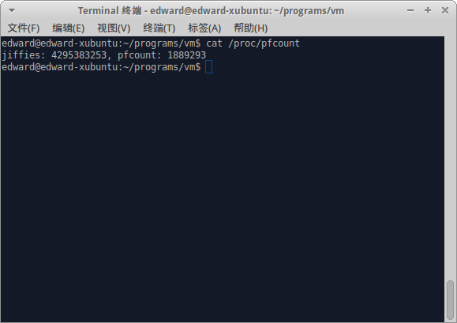
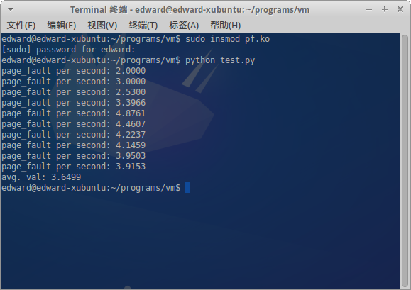

#
《操作系统》实验

##
4.3 虚拟存储器管理

###
祝嘉栋 2012211196 @304班

##1. 实验目的
学习Linux虚拟存储实现机制；编写代码，测试虚拟存储系统的缺页错误（缺页中断）发生频率。

##2. 实验内容
修改存储管理软件以便可以判断特定进程或者整个系统产生的缺页情况，达到以下目标

- 预置缺页频率参数
- 报告当前缺页频率

##3. 实验原理
由于每发生一次却也都要进入缺页中断服务函数`do_page_fault`一次，所以可以认为执行函数的次数就是系统发生缺页的次数。因此可以定义一个全局的变量`pfcount`作为计数变量，在执行`do_page_fault`时，该变量加1。系统经历的时间可以利用原有系统的变量`jiffies`，这是一个系统计时器。在内核加载以后开始计时，以10ms为计时单位。

实现可采用2种方案

1. 通过提供一个系统调用来访问内核变量`pfcount`和`jiffies`。但是增加系统变量存在诸多的不便，如重新编译内核等，而且容易出错以致系统崩溃。
2. 通过`/proc`文件系统以模块的方式提供内核变量的访问接口。在`/proc/`文件系统下建立文件`pfcount`

##4. 实验过程及结果
###下载并解压Linux源代码
	
	$ aria2c -c 
	# cp linux-3.16.tar.gz /usr/src
	# gzip -d linux-3.16.tar.gz
	# tar -xvf linux-3.16.tar
	
###修改源码以导出系统变量`pfcount`
在`/include/linux/mm.h`中增加变量声明
	
	extern unsigned long volatile pfcount;
	

在`/arch/x86/mm/fault.c`中定义变量`pfcount`

	unsigned long volatile pfcount;
	
在同文件中的`do_page_fault`函数中增加一行

	pfcount++;
	

同时在`/kernel/kallsyms.c`中导出变量`jiffies`和`pfcount`

	EXPORT_SYMBOL(jiffies);
	EXPORT_SYMBOL(pfcount);
	
###编译内核
	# make mrproper
	# make menuconfig
	# make -j4
	# make modules_install
	# make install
	# update-grub
	

###编写、编译和加载内核模块

####内核模块源码
相应注释可参考实验2.3

	> pf.c
	
	#define _GNU_SOURCE
	#define MODULE_NAME "pfcount"
	
	#include <linux/proc_fs.h>
	#include <linux/slab.h>
	#include <linux/mm.h>
	#include <linux/sched.h>
	#include <linux/string.h>
	#include <linux/types.h>
	#include <linux/ctype.h>
	#include <linux/kernel.h>
	#include <linux/version.h>
	#include <linux/seq_file.h>
	#include <linux/module.h>
	
	#define MODULE_VERSION "1.0"

	// 添加extern声明以访问导出的符号
	extern unsigned long volatile jiffies, pfcount;
	
	int pfcount_proc_show(struct seq_file * m, void * v) {
		seq_printf(m, "jiffies: %lu, pfcount: %lu\n", jiffies, pfcount);
		printk("pfcount showed.\n");
		return 0;
	}
	
	int pfcount_proc_open(struct inode * inode, struct file * file) {
		return single_open(file, pfcount_proc_show, NULL);
	}
	
	struct proc_dir_entry * proc_pfcount;
	
	const struct file_operations pfcount_proc_fops = {
		.owner = THIS_MODULE,
		.open = pfcount_proc_open,
		.read = seq_read,
		.llseek = seq_lseek,
		.release = single_release,
	};
	
	int __init init_pfcount(void)
	{
		printk("pfcount: init_module()\n");
	
		proc_pfcount = proc_create("pfcount", 0, NULL, &pfcount_proc_fops);
		printk(KERN_INFO"%s %s has initialized.\n", MODULE_NAME, MODULE_VERSION);
	
		return 0;
	}
	
	void __exit cleanup_pfcount(void)
	{
		printk("pfcount: cleanup_pfcount()\n");
		remove_proc_entry("pfcount", NULL);
		printk(KERN_INFO"%s %s has removed.\n", MODULE_NAME, MODULE_VERSION);
	}
	
	module_init(init_pfcount);
	
	module_exit(cleanup_pfcount);

####Makefile文件

	> Makefile
	
	obj-m += pf.o
	KERNEL_DIR := /lib/modules/`uname -r`/build
	MODULEDIR := $(shell pwd)
	
	modules:
		make -C $(KERNEL_DIR) M=$(MODULEDIR) modules

####编译内核模块

	$ make

####加载内核文件

	$ sudo insmod pf.ko
	
使用`dmesg`查看内核模块加载情况
	
	$ dmesg
	

观察到`pfcount`模块已经加载。

####查看在`/proc`中生成文件
	$ cat /proc/pfcount
	

####编写脚本计算缺页频率

	> test.py
	
	import time
	import string
	
	def getData():
		time.sleep(1);
		f = open("/proc/pfcount", "r")
		s = f.readline()
		f.close()
		params = s.split(',')
		jiffies = params[0]
		pfcount = params[1]
		jiffies = int(jiffies.split(":")[1])
		pfcount = int(pfcount.split(":")[1])
	
		return jiffies, pfcount
	
	def main():
		total = 0
		orig_jiffies, orig_pfcount = getData();
		for i in range(0, 10):
			jiffies, pfcount = getData()
	
			result = (pfcount - orig_pfcount) / float(jiffies - orig_jiffies)
			result *= 100
			total += result
			print "page_fault per second: " + "{:.4f}".format(result)
		print "avg. val: {:.4f}".format(total / 10)
	
	main();

运行结果

	$ python test.py
	page_fault per second: 2.8000
	page_fault per second: 3.4000
	page_fault per second: 3.3289
	page_fault per second: 3.0969
	page_fault per second: 3.1150
	page_fault per second: 2.9294
	page_fault per second: 3.8242
	page_fault per second: 3.5465
	page_fault per second: 3.5064
	page_fault per second: 3.3160
	avg. val: 3.2863

观察到每秒平均发生3.3次缺页中断。

####卸载内核模块
	$ sudo rmmod pf.ko


