#
《操作系统》实验

##
5.3 进程同步实验

###
祝嘉栋 2012211196 @304班

##1. 实验目的
深入学习Linux内核，在学习Linux内核同步机制的同时，深入分析各种同步分析的实现方案，在此基础上设计和编写一套同步原语。

##2. 实验内容
设计并实现一个新的同步原语，该源于允许多个进程因一个事件而阻塞，知道其他进程产生这个信号为止。当一个进程产生一个事件的信号时，所有因这个时间而阻塞的进程都取消阻塞。如果信号产生时，没有进程因为这个信号而阻塞，那么这个信号无效。

实现下列系统调用：

- `unsigned long eventopen(int eventNum)`
- `unsigned long eventclose(int eventNum)`
- `unsigned long eventwait(int eventNum)`
- `unsigned long eventsig(int eventNum)`

##3. 实验原理
在深入学习软中断信号，信号量和管道的动作原理和实现机制后，我们知道，一个事件必须有一个事件号，一系列的进程等待这个事件发生，那么肯定需要一个等待队列，所以睡眠的进程就放到这个队列中去。通过考察Linux中如`wake_up()`、`sleep_on()`等的实现我们将构建上述同步原语。

###事件队列

首先，设计一个事件队列类型

	typedef struct __myevent {
		int eventNum; // 事件编号
		wait_queue_head_t *p; // 等待队列头
		struct __myevent * next; // 指向下一个链表项的指针
	} myevent_t;
	
定义全局变量事件列表头指针以及尾指针

	myevent_t * lpmyevent_head = NULL, * lpmyevent_end = NULL;
	
###使进程休眠
	
下面来看如何使进程休眠。在Linux系统中要使一个进程休眠有很多种方法，Linux提供了两种高层方法

1. 调用`sleep_on()`函数（在3.15版内核中已经被删除）
2. 调用`wait_event*()`函数

下面来分析`wait_event()`函数的实现：
	
	> /include/linux/wait.h
	
	256 #define wait_event(wq, condition)                                       \
	257 do {                                                                    \
	258         if (condition)                                                  \
	259                 break;                                                  \
	260         __wait_event(wq, condition);                                    \
	261 } while (0)
	
如果等待条件已经实现则不休眠，否则调用`__wait_event()`
	
	> /include/linux/wait.h
	
	240 #define __wait_event(wq, condition)                                     \
	241         (void)___wait_event(wq, condition, TASK_UNINTERRUPTIBLE, 0, 0,  \
	242                             schedule())
	
	206 #define ___wait_event(wq, condition, state, exclusive, ret, cmd)        \
	207 ({                                                                      \
	208         __label__ __out;                                                \
	209         wait_queue_t __wait; // 创建一个等待队列                           \
	210         long __ret = ret;       /* explicit shadow */                   \
	211                                                                         \
	212         INIT_LIST_HEAD(&__wait.task_list);   // 初始化列表头              \
	213         if (exclusive)                                                  \
	214                 __wait.flags = WQ_FLAG_EXCLUSIVE;                       \
	215         else                                                            \
	216                 __wait.flags = 0;                                       \
	217                                                                         \
	218         for (;;) {
						 // 准备进入休眠                                          \
	219                 long __int = prepare_to_wait_event(&wq, &__wait, state);\
	220                                                                         \
	221                 if (condition) // 如果条件为真则跳出循环                    \
	222                         break;                                          \
	223                                                                         \
	224                 if (___wait_is_interruptible(state) && __int) {         \
	225                         __ret = __int;                                  \
	226                         if (exclusive) {                                \
	227                                 abort_exclusive_wait(&wq, &__wait,      \
	228                                                      state, NULL);      \
	229                                 goto __out;                             \
	230                         }                                               \
	231                         break;                                          \
	232                 }                                                       \
	233                                                                         \
	234                 cmd; // schedule()                                      \
	235         }                                                               \
	236         finish_wait(&wq, &__wait);   // 结束等待操作                      \
	237 __out:  __ret;                                                          \
	238 })
	
	> /include/linux/wait.h
	
	198 long prepare_to_wait_event(wait_queue_head_t *q, wait_queue_t *wait, int state)
	199 {
	200         unsigned long flags;
	201 
				 \\ 检查当前进程是否有信号处理
				 \\（适用于TASK_INTERRUPTIBLE的情况）
	202         if (signal_pending_state(state, current))
				 \\ 如果有信号处理则返回 -ERESTARTSYS，重新执行该系统调用 
	203                 return -ERESTARTSYS; 
	204 
				// 设置等待队列项目的进程指针为当前进程的指针
	205         wait->private = current; 
	206         wait->func = autoremove_wake_function;
	207 
	208         spin_lock_irqsave(&q->lock, flags); // 设置循环锁
	209         if (list_empty(&wait->task_list)) {
						 // 将当前进程加入等待队列中
	210                 if (wait->flags & WQ_FLAG_EXCLUSIVE)
	211                         __add_wait_queue_tail(q, wait);
	212                 else
	213                         __add_wait_queue(q, wait);
	214         }
				// 将当前进程设置为TASK_UNINTERRUPTIBLE状态即不可被信号唤醒
	215         set_current_state(state); 
	216         spin_unlock_irqrestore(&q->lock, flags); // 解锁
	217 
	218         return 0;
	219 }
	220 EXPORT_SYMBOL(prepare_to_wait_event);
	
	231 void finish_wait(wait_queue_head_t *q, wait_queue_t *wait)
	232 {
	233         unsigned long flags;
	234 
				// 设置当前任务状态为TASK_RUNNING即运行态
	235         __set_current_state(TASK_RUNNING); 
	236         /*
	237          * We can check for list emptiness outside the lock
	238          * IFF:
	239          *  - we use the "careful" check that verifies both
	240          *    the next and prev pointers, so that there cannot
	241          *    be any half-pending updates in progress on other
	242          *    CPU's that we haven't seen yet (and that might
	243          *    still change the stack area.
	244          * and
	245          *  - all other users take the lock (ie we can only
	246          *    have _one_ other CPU that looks at or modifies
	247          *    the list).
	248          */
				 // 如果队列非空
	249         if (!list_empty_careful(&wait->task_list)) {
						 // 设置循环锁
	250                 spin_lock_irqsave(&q->lock, flags); 
						 // 将等待队列项目从等待队列中删除
	251                 list_del_init(&wait->task_list); 
						 // 解锁
	252                 spin_unlock_irqrestore(&q->lock, flags); 
	253         }
	254 }

可以看出，使一个进程休眠至少要经过如下过程：

1. 将进程放入等待队列中
2. 将进程的状态设置为`TASK_UNINTERRUPTIBLE`或者`TASK_INTERRUPTIBLE` (若是`TASK_INTERRUPTIBLE`则唤醒线程时要检查是否是被信号所唤醒的，若是则要重新进入休眠）
3. 令内核进行进程调度，此时进程真正进入休眠
4. 当进程被唤醒，要将进程从等待队列中删除

则我们可以根据这个过程来设计同步原语。

##4. 实验步骤及代码清单
####实验环境
- xubuntu 14.10 @ 2.5GHz Intel Core i5
- Linux 3.16
- Parallel Desktop 10

###1. 设计事件队列类型
	> /kernel/my_event.c
	
	typedef struct __myevent {
		int eventNum;
		wait_queue_head_t *p;
		struct __myevent * next;
	} myevent_t;
	
	myevent_t * lpmyevent_head = NULL, * lpmyevent_end = NULL;

###2. 实现函数定义
####`eventopen` 系统调用
定义`open`同步原语，当open一个事件的时候有两种情况：一是事件已经存在，只需要返回事件的事件号即可；第二种是事件链表中没有该事件，简单的处理办法直接返回-1，表示时间不存在。当传递参数0的时候，将产生一个新事件。

	> /kernel/my_event.c
	
	SYSCALL_DEFINE1(eventopen, int, eventNum)
	{
		myevent_t * new;
		myevent_t * prev;
		if (eventNum) // 如果事件编号不为0
		{
			if (!scheventNum(eventNum, &prev)) // 如果不存在该事件，则返回-1
			{
				return -1;
			}
			else {
				return eventNum; // 否则返回事件编号
			}
		}
		else
		{
		 	// 创建一个新事件
			new = (myevent_t *)kmalloc(sizeof(myevent_t), GFP_KERNEL);
			// 为等待队列头分配内存空间
			new->p = (wait_queue_head_t *)kmalloc(sizeof(wait_queue_head_t), GFP_KERNEL);
			// 初始化等待队列
			init_waitqueue_head(new->p);
			// 将事件放入事件列表中
			new->next = NULL;
			if (!lpmyevent_head)
			{
				new->eventNum = 2;
				lpmyevent_head = lpmyevent_end = new;
				return new->eventNum;
			}
			else
			{
				new->eventNum = lpmyevent_end->eventNum + 2;
				lpmyevent_end->next = new;
				lpmyevent_end = new;
			}
			
			// 返回新加入的事件编号
			return new->eventNum;
		}
		return 0;
	}

####`eventwait` 系统调用
将一个进程加到其要等待的事件队列中去

	> /kernel/my_event.c
	
	SYSCALL_DEFINE1(eventwait, int, eventNum)
	{
		myevent_t * tmp = NULL;
		myevent_t * prev = NULL;
	
		if ((tmp = scheventNum(eventNum, &prev))) // 找到事件编号对应事件
		{
			printk("DECLARE waitqueue.\n");
			DECLARE_WAITQUEUE(wait, current); // 创建关于当前进程的新的等待队列项
			printk("set state.\n");
			set_current_state(TASK_UNINTERRUPTIBLE); // 将当前进程的状态设置为TASK_UNINTERRUPTIBLE
			printk("add wait queue\n");
			add_wait_queue(tmp->p, &wait); // 将当前进程加入等待队列
			printk("schedule()\n");
			schedule(); // 进行进程调度
	
			remove_wait_queue(tmp->p, &wait); // 将进程从等待队列中删除
		}
	
		return 0; // 若未找到则返回0
	}

####`eventsig` 系统调用
定义`eventsig(int eventNum)`，`eventsig()`要完成的功能是唤醒所有等待该事件发生的进程。我们只需要在事件列表上找到该事件，然后调用`wake_up()`。

	> /kernel/my_event.c
	
	int do_eventsig(int eventNum)
	{
		myevent_t * tmp = NULL;
		myevent_t * prev = NULL;
	
		if (!(tmp = scheventNum(eventNum, &prev))) {
			return 0;
		}
		wake_up(tmp->p);
		return 1;
	}
	
	SYSCALL_DEFINE1(eventsig, int, eventNum)
	{
		return do_eventsig(eventNum);
	}
	

####`eventclose` 系统调用
至于`eventclose()`先在事件队列中找到该事件，然后根据事件在链表中的位置进行特定的处理，之后唤醒所有睡眠在该事件上的进程，最后将这个事件从链表中删除，释放内存。

	> /kernel/my_event.c
	
	SYSCALL_DEFINE1(eventclose, int, eventNum)
	{
		myevent_t * prev = NULL;
		myevent_t * releaseItem = NULL;
	
		do_eventsig(eventNum);
		printk("before delete.\n");
		print_event_list(lpmyevent_head);
	
		if((releaseItem = scheventNum(eventNum, &prev)))
		{
			printk("ready to delete: %d\n", eventNum);
			if (releaseItem == lpmyevent_end)
			{
				lpmyevent_end = prev;
			}
			if (releaseItem == lpmyevent_head)
			{
				lpmyevent_head = lpmyevent_head->next;
				goto wake;
			}
	
			prev->next = releaseItem->next;
		}
	wake:
		if (releaseItem)
		{
			kfree(releaseItem);
	
			print_event_list(lpmyevent_head);
			return 1;
		}
		printk("after delete.\n");
		printk("can't find : %d\n", eventNum);
	
		return 0;
	}

####`scheventNum` 函数
找到事件编号对应的事件，返回其指针。若找不到则返回`NULL`。
	
	> /kernel/my_event.c
		
	myevent_t * scheventNum(int eventNum, myevent_t **prev)
	{
		myevent_t * tmp = lpmyevent_head;
		*prev = NULL;
		while(tmp)
		{
			if (tmp->eventNum == eventNum)
			{
				return tmp;
			}
			*prev = tmp;
			tmp = tmp->next;
		}
		return NULL;
	}

####`eventshow` 系统调用和`print_event_list`
实现了一个打印当前事件队列的系统调用。

	> /kernel/my_event.c
	
	void print_event_list(myevent_t * head)
	{
		printk(KERN_DEBUG"event_list: ");
		while(head) {
			printk(" %d", head->eventNum);
			head = head->next;
		}
		printk("\n");
		return 0;
	}
	
	SYSCALL_DEFINE0(eventshow)
	{
		print_event_list(lpmyevent_head);
	
		return 0;
	}

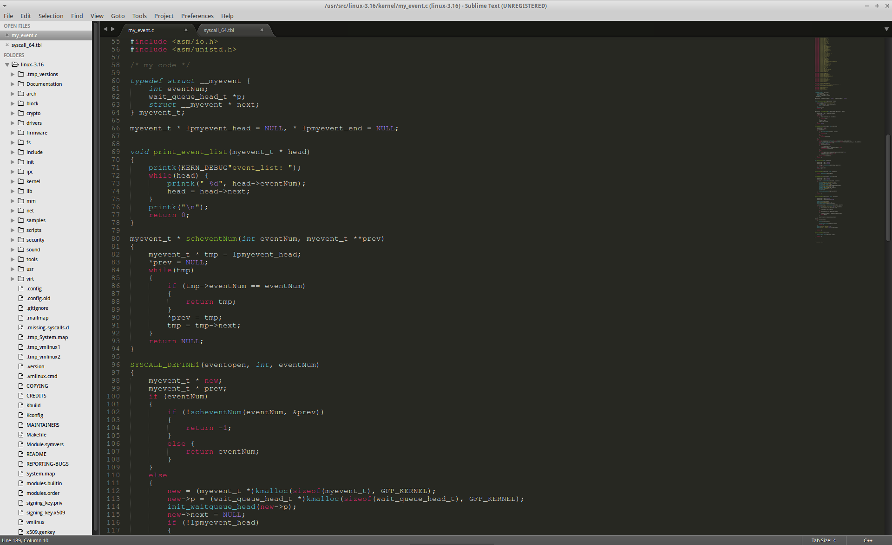

###3. 修改系统调用表
在`/arch/x86/syscalls/syscall_64.tbl`中加入如下内容

	> /arch/x86/syscalls/syscall_64.tbl
	
	# my syscall
	
	320 common eventopen	sys_eventopen
	321 common eventclose	sys_eventclose
	322 common eventwait	sys_eventwait
	323 common eventsig		sys_eventsig
	324 common eventshow	sys_eventshow
	
	# my syscall end
	
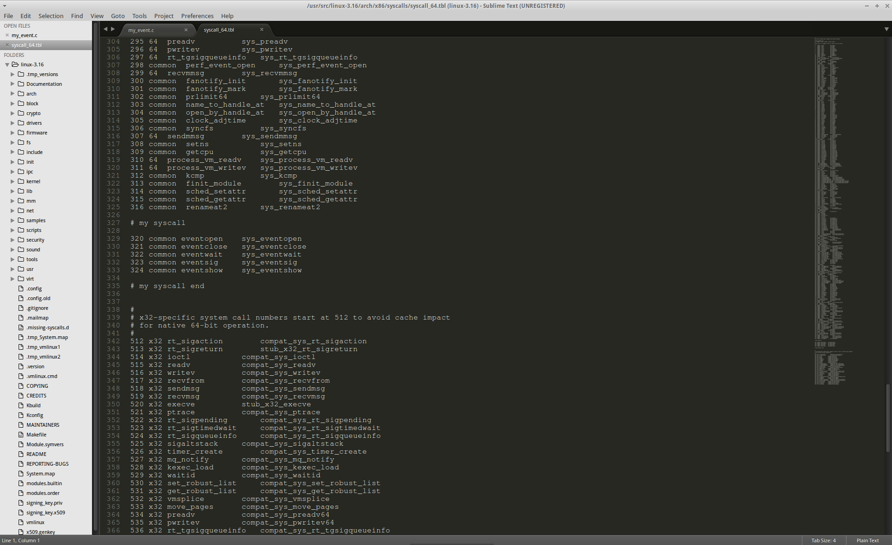

###4. 修改内核编译Makefile
在`/kernel/Makefile`中找到
	
	> /kernel/Makefile
	
	obj-y     = fork.o exec_domain.o panic.o \
		    cpu.o exit.o itimer.o time.o softirq.o resource.o \
		    sysctl.o sysctl_binary.o capability.o ptrace.o timer.o user.o \
		    signal.o sys.o kmod.o workqueue.o pid.o task_work.o \
		    extable.o params.o posix-timers.o \
		    kthread.o sys_ni.o posix-cpu-timers.o \
		    hrtimer.o nsproxy.o \
		    notifier.o ksysfs.o cred.o reboot.o \
		    async.o range.o groups.o smpboot.o

在末尾加入`my_event.o`

	> /kernel/Makefile
	
	obj-y     = fork.o exec_domain.o panic.o \
	    cpu.o exit.o itimer.o time.o softirq.o resource.o \
	    sysctl.o sysctl_binary.o capability.o ptrace.o timer.o user.o \
	    signal.o sys.o kmod.o workqueue.o pid.o task_work.o \
	    extable.o params.o posix-timers.o \
	    kthread.o sys_ni.o posix-cpu-timers.o \
	    hrtimer.o nsproxy.o \
	    notifier.o ksysfs.o cred.o reboot.o \
	    async.o range.o groups.o smpboot.o my_event.o

###5. 编译内核
	
	# make mrproper
	# make localconfig // 使用本地内核设置以减少编译时间
	# make -j4
	# make modules_install
	# make install

###6. 测试

####测试程序代码

#####open.c
	#include <linux/unistd.h>
	#include <stdio.h>
	#include <stdlib.h>
	
	#define EVENTOPEN 320
	
	int main(int argc, char ** argv)
	{
		int i;
	
		if (argc != 2)
		{
			return -1;
		}
	
		i = syscall(EVENTOPEN, atoi(argv[1]));
		printf("open : %d\n", i);
		return 1;
	}

#####close.c
	#include <linux/unistd.h>
	#include <stdio.h>
	#include <stdlib.h>
	
	#define EVENTCLOSE	321
	#define EVENTWAIT	322
	#define EVENTSIG	323
	
	int main(int argc, char ** argv)
	{
		int i;
		if (argc != 2)
		{
			return -1;
		}
	
		syscall(EVENTCLOSE, atoi(argv[1]));
		printf("close : %d\n", i);
		return 1;
	}

#####wait.c
	#include <linux/unistd.h>
	#include <stdio.h>
	#include <stdlib.h>
	
	#define EVENTCLOSE	321
	#define EVENTWAIT	322
	#define EVENTSIG	323
	
	int main(int argc, char ** argv)
	{
		int i;
		if (argc != 2)
		{
			return -1;
		}
	
		i = syscall(EVENTWAIT, atoi(argv[1]));
		printf("wait : %d\n", i);
		return 1;
	}

#####sig.c
	#include <linux/unistd.h>
	#include <stdio.h>
	#include <stdlib.h>
	
	#define EVENTCLOSE	321
	#define EVENTWAIT	322
	#define EVENTSIG	323
	
	int main(int argc, char ** argv)
	{
		int i = 3;
		if (argc != 2)
		{
			return -1;
		}
	
		syscall(EVENTSIG, atoi(argv[1]));
		printf("%d\n", i);
		return 1;
	}

#####test.c
	#include <linux/unistd.h>
	#include <stdio.h>
	#include <stdlib.h>
	
	#define EVENTCLOSE	321
	#define EVENTWAIT	322
	#define EVENTSIG	323
	#define EVENTSHOW	324
	
	int main(int argc, char ** argv)
	{
		syscall(EVENTSHOW);
		return 1;
	}

以上5个程序分别调用了相应的系统调用，参数通过命令行参数传递。分别编译5个程序。

####测试
首先使用`open`原语创建两个事件
	
	$ ./open 0
	$ ./open 0

使用`eventshow`系统调用查看当前事件队列

	$ ./test
	$ dmesg

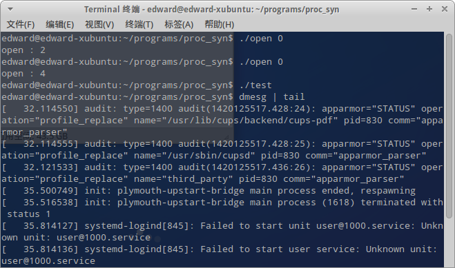
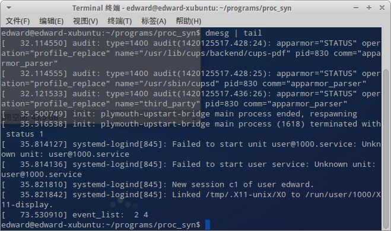
	
观察到事件2和4加入到了事件队列。

使用`wait`原语使两个进程挂到事件2，在使用一次将一个进程挂到事件4

	$ ./wait 2
	$ ./wait 2
	$ ./wait 4
	
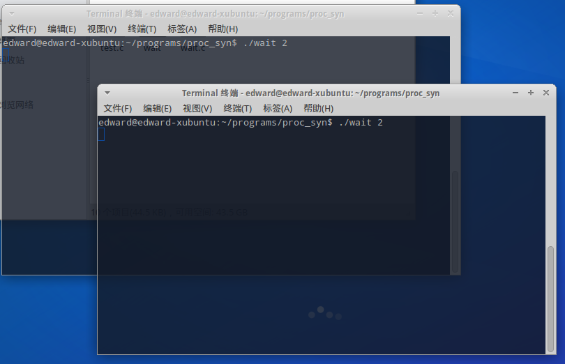
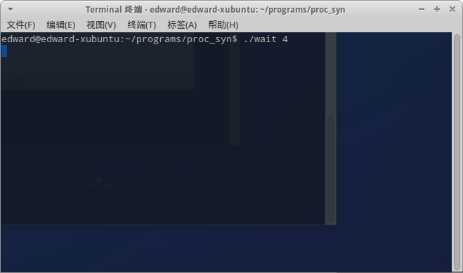

观察到进程进入休眠
	
使用`pgrep`命令查询进程编号，再使用`top`命令查看进程运行状态
	
	$ pgrep wait
	$ top -p [pid1] -p [pid2]

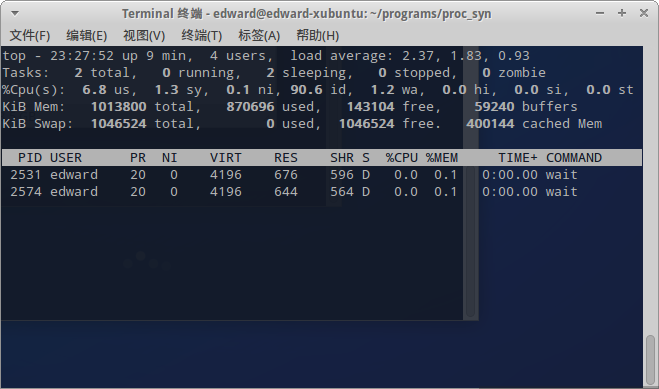
	
观察到进程运行状态为D，即`TASK_INTERRUPTIBLE``

使用`sig`原语将事件2的进程唤醒

	$ ./sig 2

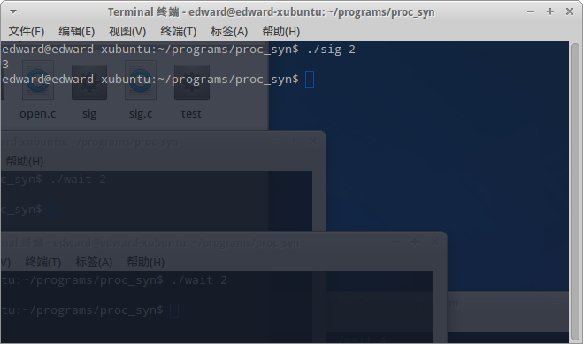
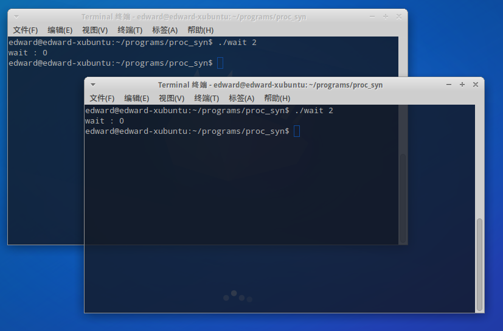

观察到与进程2相关的两个进程运行结束。

使用close原语将事件4关闭，再使用`dmesg`命令查看内核日志输出。

	$ ./close 4
	$ dmesg
	
发现与事件4对应的进程运行结束，事件列表中事件4已被移除。

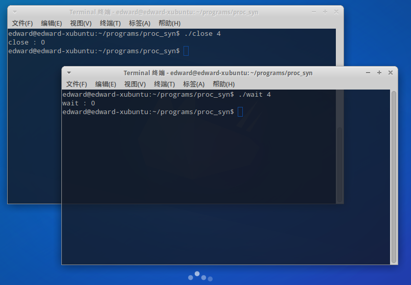
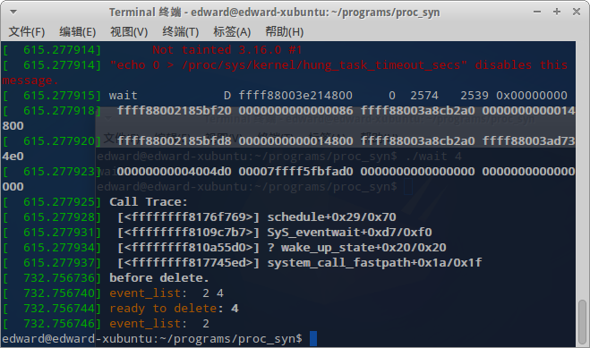	

##参考资料
- [内核实验9：设计一个同步机制](http://jpkc.zju.edu.cn/k/505/pdf/nihe9.pdf) - 浙江大学计算机学院
- [CS45 Lab 3: Implementing a Synchronization Primative](http://www.cs.swarthmore.edu/~newhall/cs45/s14/Labs/lab03.php) - Swarthmore College Computer Science Department
- [Linux Cross Reference](http://lxr.free-electrons.com/source/) - Free Electrons
- [睡眠--TASK_INTERRUPTIBLE and TASK_UNINTERRUPTIBLE](http://www.cnblogs.com/parrynee/archive/2010/01/14/1648165.html) - Parry Nee
