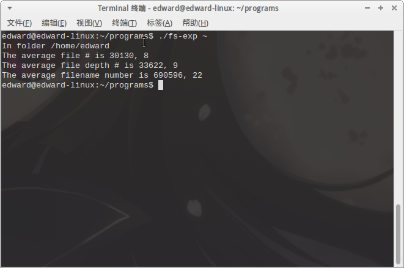

#
《操作系统》实验

##
7.2 文件系统管理实验 - 编程实验1

###
祝嘉栋 2012211196 @304班

##1. 实验目的与内容
在Linux下，编写Shell程序，计算磁盘上所有目录下平均文件个数、所有目录平均长度、所有文件名平均长度。
通过此实验，了解Linux系统文件管理相关机制

##2. 程序源码
	#include <stdio.h>
	#include <sys/stat.h>
	#include <dirent.h>
	#include <string.h>
	
	int func(char * path, int * AllFileNumber, int * AllDepthNumber, 
		int * AllFilenameNumber, int * AllFolderNumber)
	{
		struct stat statbuf;
		struct dirent * dirp;
		DIR * dp;
		char str1[1000];
		char * str2;
		int has_gen_path = 0, ret;
		size_t len;
	
		stat(path, &statbuf); // 获取该目录下的文件系统信息
	
		switch(statbuf.st_mode & S_IFMT) {
			case S_IFREG: { // 如果是普通文件
				// 计算文件名长度
				spos = strrchr(path, '/');
				len = strlen(path) - (size_t)(spos - path);
				*AllFilenameNumber += len;
				*AllFilenameNumber += strlen(path); // 增加文件名长度
				*AllFileNumber = * AllFileNumber + 1; // 增加文件数
				*AllDepthNumber = *AllDepthNumber + 1; // 增加文件深度
				break;
			}
	
			case S_IFDIR: {
				*AllDepthNumber = *AllDepthNumber + 1; // 增加文件深度
				*AllFolderNumber = *AllFolderNumber + 1; // 增加文件夹数
				dp = opendir(path);	 // 打开文件夹
				if (dp == NULL) {
					return 0; // 若打开失败则返回0
				}
				while((dirp = readdir(dp)) != NULL) { // 遍历文件夹下的所有文件
					if ((strcmp(dirp->d_name, ".") == 0) 
						|| strcmp(dirp->d_name, "..") == 0)
					{
						continue; // 若文件夹是"."或者".."则跳过
					}
					// 如果还没有将当前路径存至str1
					if (has_gen_path == 0) { 
						strcpy(str1, path); // 将当前目录存至str1
						// 获取当前路径字符串末尾指针
						str2 = str1 + strlen(str1); 
						has_gen_path = 1;
					}
					*str2++ = '/';
					*str2 = '\0';
					// 将当前文件名拷贝至当前路径末尾
					strcpy(str2, dirp->d_name); 
					// 递归扫描子目录
					ret = func(str1, AllFileNumber, 
						AllDepthNumber, AllFilenameNumber, AllFolderNumber);
					*str2--;
					*str2 = '\0';
					
				}
				closedir(dp); // 关闭当前文件夹
				break;
			}
		}
		return 1;
	}
	
	int main(int argc, char * argv[])
	{
		int ret;
		int AllFileNumber = 0;
		int AllDepthNumber = 0;
		int AllFilenameNumber = 0;
		int AllFolderNumber = 0;
		printf("%s\n", argv[1]);
		ret = func(argv[1], &AllFileNumber, 
			&AllDepthNumber, &AllFilenameNumber, &AllFolderNumber);
		printf("The average file # is %d\n", 
			AllFileNumber / AllFolderNumber);
		printf("The average file depth # is %d\n", 
			AllDepthNumber / AllFolderNumber);
		printf("The average filename number is %d\n", 
			AllFilenameNumber / AllFileNumber);
	
		return 0;
	}


##3. 实验结果

运行程序

	$ ./fs-exp ~



如图，程序正确扫描了该目录下所有文件和子目录，并计算出该目录下每个子文件夹中的平均文件数，平均文件深度，以及所有文件的平均文件名长度。

